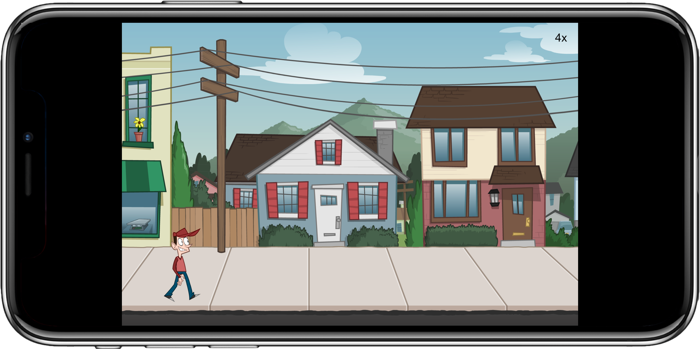

Solar2D Image Sheet Example
===========================

Sample code which demonstrates how to use sprite sheets generated with 
[TexturePacker](https://www.codeandweb.com/texturepacker) in a
[Solar2D](https://solar2d.com) application.

A detailed tutorial can be found
[here](https://www.codeandweb.com/texturepacker/tutorials/texturepacker-corona-imagesheet-tutorial).

